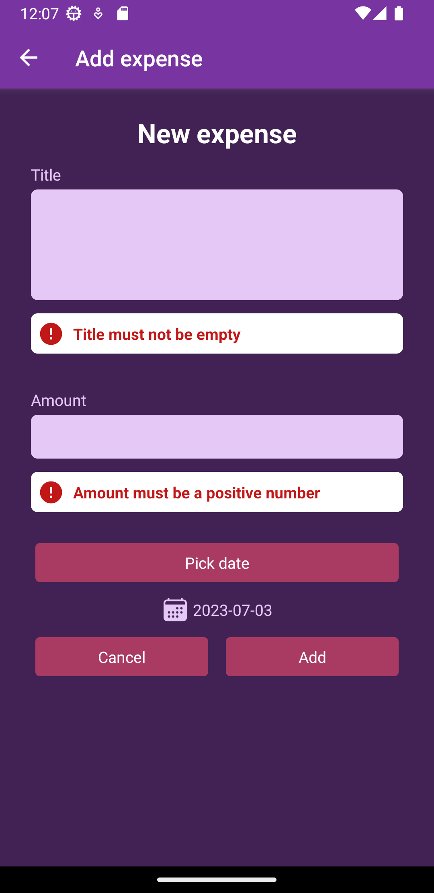
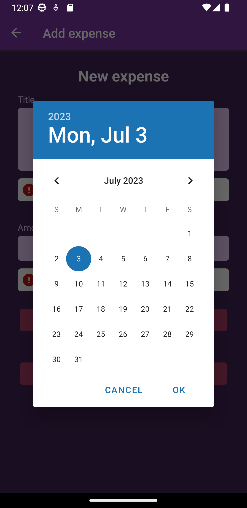
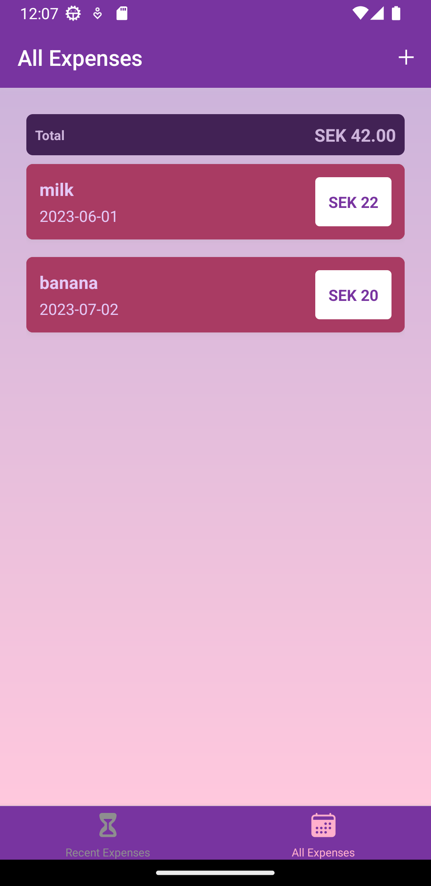
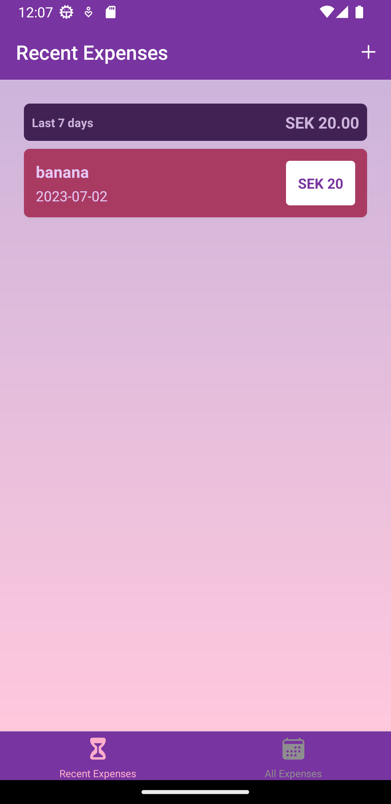

# Expense Tracker App

## Description
A React Native expense tracker app built using Expo. The app allows users to track their expenses by entering the title, amount, and date of each expense.

## Features
- Add expenses with a title, amount, and date.
- Select the expense date using the date picker (defaults to today's date).
- View a list of All expenses with their details as well as Recent expenses (in the last 7 days).
- Edit or delete existing expenses.
- Responsive bottom tabs navigation using React Navigation.

## Screenshots

  
  
  
    

## Prerequisites
- Node.js and npm should be installed on your machine.
- Expo CLI should be installed globally.
- Android emulator or a physical Android device for testing.
  
## Installation
1. Clone the repository or download the source code.
2. Open a terminal and navigate to the project directory.
3. Run npm install to install the required dependencies.
4. Run expo start to start the Expo development server.
5. Use an Android emulator or scan the QR code with the Expo app on your physical Android device to launch the app.
   
## Usage
- Upon launching the app, you will see the expense list screen.
- To add a new expense, tap on the "+" button.
- Enter the expense details (title, amount, and date) in the provided fields.
- To change the expense date, tap on the date field and use the date picker.
- Tap on the "Add" button to add the expense.
- To edit or delete an existing expense, tap on the expense item and select the appropriate action.
- Use the bottom tabs for navigating between different screens.

## Data Storage
The app utilizes AsyncStorage to store expenses locally on the device. This allows for persistent storage of expenses even when the app is closed or restarted. AsyncStorage is a simple key-value storage system provided by React Native.
  
## Dependencies
- React Native: 0.71.8
- Expo: 48.0.18
- React Navigation: 6.0.2
- @react-native-community/datetimepicker: 6.7.3
- @react-native-async-storage/async-storage: 1.17.11
- @reduxjs/toolkit": "^1.9.5"
